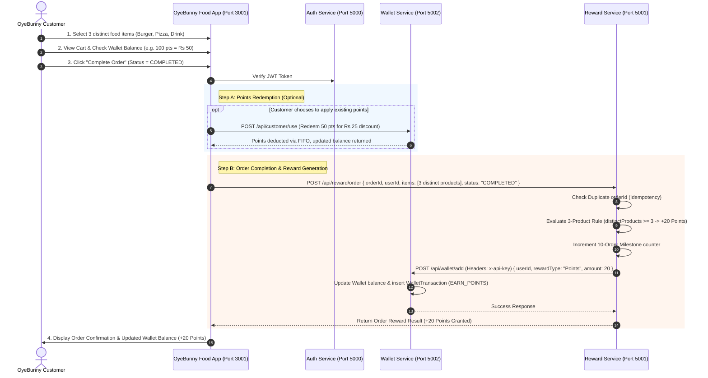

# SuperApp Ecosystem: Reward & Wallet Microservices System

Welcome to the **Reward & Wallet Microservices Ecosystem** repository. This document serves as the master specification, system architecture, API handbook, and developer operations guide for the complete system.

---

## 1. Executive Summary & Project Overview

This project is a core microservices infrastructure component of a larger **SuperApp** ecosystem that supports multi-application integration (e.g., **OyeBunny Food Delivery App**, **SuperMall App**, and future services). 

The ecosystem decouples reward logic from balance management into independent microservices:
1. **Auth Service (Port 5000)**: Manages customer registration, login, JWT token generation, and user identity profile.
2. **Reward Service (Port 5001)**: Responsible for rule evaluation, reward calculations (referrals, product combinations, order milestones), order cancellation/revocation (`POST /api/reward/cancel`), eligibility verification, and event logging.
3. **Wallet Service (Port 5002)**: Maintains customer wallet balances (points and free delivery tokens), manages transaction history, executes FIFO point redemptions/conversions, revokes rewards (`POST /api/wallet/remove`), and processes reward expirations (`expiryCron.js`).
4. **Admin Panel (Port 3000)**: Next.js 14 dashboard for administrators to edit reward rules (`PRODUCT_REWARD_3`, expiry days, status) and view customer wallet histories.
5. **OyeBunny Food App (Port 3001)**: Consumer-facing food delivery web application prototype UI for browsing food products, cart management with distinct product tracking, checkout payments, wallet points discount conversion (2 Points = Rs. 1), order completion, and real-time wallet history.

---

## 2. Business Rules & Reward Specifications

| Rule Category | Business Rule Description | Reward Granted | Key Constraints & Conditions |
| :--- | :--- | :--- | :--- |
| **Product Reward** | Customer purchases **3 distinct products** in a single order. | **+20 Reward Points** | Only distinct product IDs count. Categories are ignored. Repeating the same product (e.g., 3x Burger) does NOT qualify. |
| **Referral Reward** | User A refers User B. User B completes their first order. | **+100 Reward Points** (to Referrer only) | Referred user gets 0 reward points. Reward is credited ONLY after referred user's order is marked `COMPLETED`. |
| **Free Delivery Milestone** | Customer completes **10 successful orders**. | **+1 Free Delivery Token** | Only orders with status `COMPLETED` count. Cancelled, failed, or pending orders are excluded. Token valid for 1 free delivery. |
| **Reward Conversion** | Conversion of reward points into currency discount. | **2 Points = Rs. 1** *(100 Points = Rs. 50)* | Points can cover up to 100% of order total. |
| **Reward Expiry** | Every earned reward point/token has a fixed lifespan. | Expiry: **45 Days** | Expired rewards transition to status `EXPIRED`, cannot be used, but remain permanently in transaction history. |
| **Duplicate Protection** | Idempotency guard for order processing. | Single Grant | One `orderId` can generate rewards only once. Duplicate requests return a duplicate warning without re-crediting points. |
| **Order Completion Rule** | Trigger condition for reward evaluation. | Mandatory `COMPLETED` Status | Rewards are generated strictly after Order Status = `COMPLETED`. Pending/Processing orders generate zero rewards. |
| **Order Cancellation** | Revocation logic on order cancellation. | Status: `REVOKED` | If a completed order is cancelled/refunded (`POST /api/reward/cancel`), generated rewards are revoked from the wallet automatically via `POST /api/wallet/remove`. |

---

## 3. Microservices Architecture & Data Flow

```
+-----------------------------------------------------------------------------------+
|                                  SUPERAPP ECOSYSTEM                               |
+-----------------------------------------------------------------------------------+
|                                                                                   |
|  +---------------------------+              +----------------------------------+  |
|  | OyeBunny Food App (UI)    |              | Admin Panel (Next.js Dashboard)  |  |
|  | [Consumer App: Port 3001]  |              | [Admin Portal: Port 3000]        |  |
|  +-------------+-------------+              +-----------------+----------------+  |
|                |                                              |                   |
|                | REST API (JWT)                               | REST API (JWT)    |
|                v                                              v                   |
|  +---------------------------+    Secret API Key    +--------------------------+  |
|  | Reward Service            | -------------------> | Wallet Service           |  |
|  | (Port 5001)               |  (x-api-key Header)  | (Port 5002)              |  |
|  +-------------+-------------+                      +-------------+------------+  |
|                |                                                  |               |
|                v                                                  v               |
|  +---------------------------+                      +--------------------------+  |
|  | MongoDB: reward_db        |                      | MongoDB: wallet_db       |  |
|  | - reward_rules            |                      | - wallets                |  |
|  | - reward_transactions     |                      | - wallet_transactions    |  |
|  | - referral_records        |                      | - reward_histories       |  |
|  | - reward_logs             |                      +--------------------------+  |
|  +---------------------------+                                                    |
|                                                                                   |
|  +-----------------------------------------------------------------------------+  |
|  | Auth Service (Port 5000) -> MongoDB: auth_db (User Credentials)              |  |
|  +-----------------------------------------------------------------------------+  |
+-----------------------------------------------------------------------------------+
```

---

## 4. System Component Status

| Component | Port | Status | Implemented Features |
| :--- | :--- | :--- | :--- |
| **`auth-service`** | `5000` | **100% Complete** | User registration, login, JWT token issuance, password hashing, `/api/auth/me`. |
| **`reward-service`** | `5001` | **100% Complete** | Express architecture, MongoDB models (`RewardRule`, `RewardTransaction`, `ReferralRecord`, `RewardLog`), rule evaluation engine (3-product rule, 10-order milestone, referrals), cancellation endpoint (`POST /api/reward/cancel`), inter-service `walletApiClient`, Admin rule API endpoints (`GET/PUT /api/reward/rules`). |
| **`wallet-service`** | `5002` | **100% Complete** | Express architecture, MongoDB models (`Wallet`, `WalletTransaction`, `RewardHistory`), FIFO point redemption logic, add/use/remove/expire API endpoints (`POST /api/wallet/remove`), customer-facing `/api/customer/wallet` routes, automated `expiryCron` job. |
| **`admin-panel`** | `3000` | **100% Complete** | Next.js 14 App Router, Admin authentication, Dashboard stats, Reward Rules editor UI, Customer wallet viewer. |
| **`oyebunny-app`** | `3001` | **100% Complete** | Consumer food delivery web UI, food catalog (Burgers, Pizzas, Drinks, Desserts), Cart drawer, distinct product counter, checkout page, points discount toggle (2 Points = Rs. 1), order completion, order confirmation, real-time wallet history. |

---

## 5. End-to-End Procedure: 3-Product Order & Wallet Reward Flow



---

## 6. Service API Reference & Admin Credentials

### Service Ports & Environment Variables

| Service | Port | Database URI | Key Environment Variables |
| :--- | :--- | :--- | :--- |
| **`auth-service`** | `5000` | `mongodb://localhost:27017/auth_db` | `JWT_SECRET`, `PORT=5000` |
| **`reward-service`** | `5001` | `mongodb://localhost:27017/reward_db` | `PORT=5001`, `WALLET_SERVICE_URL=http://localhost:5002`, `SERVICE_API_KEY=super_secret_service_key_2026` |
| **`wallet-service`** | `5002` | `mongodb://localhost:27017/wallet_db` | `PORT=5002`, `SERVICE_API_KEY=super_secret_service_key_2026` |
| **`admin-panel`** | `3000` | N/A (Frontend) | `NEXT_PUBLIC_AUTH_API=http://localhost:5000`, `NEXT_PUBLIC_REWARD_API=http://localhost:5001`, `NEXT_PUBLIC_WALLET_API=http://localhost:5002` |
| **`oyebunny-app`** | `3001` | N/A (Frontend) | `NEXT_PUBLIC_AUTH_SERVICE_URL=http://localhost:5000`, `NEXT_PUBLIC_REWARD_SERVICE_URL=http://localhost:5001`, `NEXT_PUBLIC_WALLET_SERVICE_URL=http://localhost:5002` |

### Default Admin Credentials

* **Reward Service Admin**:
  * **Email**: `admin@rewards.com`
  * **Password**: `Admin@12345`
* **Wallet Service Admin**:
  * **Email**: `admin@wallet.com`
  * **Password**: `Admin@12345`

### Core API Endpoints

#### 1. Auth Service (`http://localhost:5000`)
- `POST /api/auth/register`: Customer account registration.
- `POST /api/auth/login`: Customer authentication login.
- `GET /api/auth/me`: Fetch authenticated user profile.

#### 2. Reward Service (`http://localhost:5001`)
- `POST /api/reward/order`: Evaluate completed order for rewards (+20 points for 3 distinct products).
- `POST /api/reward/cancel`: Cancel order and revoke generated rewards via Wallet Service.
- `POST /api/reward/referral`: Register referral mapping.
- `GET /api/reward/rules`: Fetch active reward rules (Admin).
- `PUT /api/reward/rules/:ruleKey`: Update rule parameters (Admin).

#### 3. Wallet Service (`http://localhost:5002`)
- `POST /api/wallet/add`: Credit points/tokens to wallet (Service-to-Service, requires `x-api-key`).
- `POST /api/wallet/use`: Consume points/tokens (Service-to-Service, requires `x-api-key`).
- `POST /api/wallet/remove`: Revoke reward points (Service-to-Service, requires `x-api-key`).
- `GET /api/wallet/balance?userId=...`: Query wallet balance.
- `GET /api/wallet/history?userId=...`: Query wallet transaction ledger.
- `GET /api/customer/wallet`: Customer wallet balance (Authenticated via JWT).
- `POST /api/customer/use`: Customer redeem points for discount (Authenticated via JWT).

---

## 7. How to Run the Project Locally

### Prerequisites
- **Node.js** (v18+)
- **MongoDB** (Running on `mongodb://localhost:27017`)

---

### Step 1: Ensure MongoDB is Running

Make sure MongoDB is running on port `27017`.

```powershell
mongod
```
*(Or ensure the MongoDB service is running via Windows Services or Docker).*

---

### Step 2: Launch the 5 Applications

Open 5 separate terminal windows (or terminal tabs) and run:

#### Terminal 1 — Auth Service (Port 5000)
```powershell
cd "d:\saad work\reward system\auth-service"
npm run dev
```

#### Terminal 2 — Wallet Service (Port 5002)
```powershell
cd "d:\saad work\reward system\wallet-service"
npm run dev
```

#### Terminal 3 — Reward Service (Port 5001)
```powershell
cd "d:\saad work\reward system\reward-service"
npm run dev
```

#### Terminal 4 — Admin Panel (Port 3000)
```powershell
cd "d:\saad work\reward system\admin-panel"
npm run dev
```

#### Terminal 5 — OyeBunny Food Delivery App (Port 3001)
```powershell
cd "d:\saad work\reward system\oyebunny-app"
npm run dev
```

---

### Step 3: Open in Browser & Test

1. **OyeBunny Food App**: Open **[http://localhost:3001](http://localhost:3001)**
   - Click **Register** to create a customer account.
   - Add **3 distinct products** (e.g. 1x Burger, 1x Pizza, 1x Drink) to your cart.
   - Go to **Checkout**, toggle **Apply Reward Points Discount**, and click **Complete Order**.
   - Verify the order confirmation shows **+20 Reward Points granted** by the backend Reward Engine.
   - Open **My Wallet & History** (`/wallet`) to view the updated points balance and ledger.

2. **Admin Panel**: Open **[http://localhost:3000](http://localhost:3000)**
   - Login using Admin credentials (`admin@rewards.com` / `Admin@12345`).
   - Edit reward rules (such as `PRODUCT_REWARD_3` value or expiry days) and view customer wallet ledgers.

---

## 8. Troubleshooting & Common Issues

* **`Failed to fetch` or `ERR_CONNECTION_REFUSED`**:
  * Ensure `auth-service` (Port 5000), `reward-service` (Port 5001), and `wallet-service` (Port 5002) are running in your terminal windows.
* **`MongooseServerSelectionError: connect ECONNREFUSED 127.0.0.1:27017`**:
  * Start your local MongoDB server using `mongod` or check your MongoDB service in Windows Task Manager.

---
*Document updated for complete microservices integration & operations alignment.*
